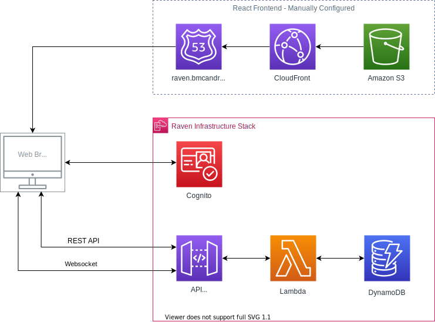

# Raven Messenger - AWS Infrastructure

🖼️ [React Frontend](https://github.com/barrymcandrews/raven-react)

🚀 [Live Demo](https://raven.bmcandrews.com)


<!-- ABOUT THE PROJECT -->
## About The Project
Raven Messenger is a fictional serverless chat application developed as an example. It uses API Gateway, Cognito, Lambda and DynamoDB to form an extremely cost-effective backend that scales out as users grow. This project creates both a REST API and a WebSocket API which are consumed by my [React Frontend](https://github.com/barrymcandrews/raven-react) which I have hosted in a seperate repository.

### Built With [AWS CDK](https://github.com/aws/aws-cdk)
The [AWS CDK](https://github.com/aws/aws-cdk) (Cloud Development Kit) is an open-source development framework for generating CloudFormation templates using high level abstractions. With it you can define a lot of infrastructue using only a few lines of code. This framework doen't solve all the current problems with Infrastructure as Code. But after using this framework for awhile, I really believe it's the future of IaC.

### Infrastructure
<p align="center">
  
</p>


<!-- GETTING STARTED -->
## Getting Started

Unfortunately, there is currently no way to simulate AWS infrastructure locally on your computer. So in order to test this code you'll need to deploy it into your own AWS account. Luckily with all these services you pay for only what you use, so the cost should be very small.

### Prerequisites

Install or update the AWS CDK CLI from npm (requires Node.js ≥ 10.3.0):
```sh
$ npm i -g aws-cdk
```

Ensure that your [AWS Credentials File](https://docs.aws.amazon.com/cli/latest/userguide/cli-configure-files.html) is set up properly with your AWS account.

### Installation

Install NPM packages
```sh
npm install
```

<!-- USAGE EXAMPLES -->
## Usage

 * `npm run build`   compile typescript to js
 * `npm run watch`   watch for changes and compile
 * `npm run test`    perform the jest unit tests
 * `npm run lint`    runs eslint on the project
 * `cdk deploy`      deploy this stack to your default AWS account/region
 * `cdk diff`        compare deployed stack with current state
 * `cdk synth`       emits the synthesized CloudFormation template

<!-- ROADMAP -->
## Roadmap

I've implemented all the features I planned for version one of this project. As I develop new frontends, I'll add new features as I need them. 


<!-- CONTACT -->
## Contact

Barry McAndrews - bmcandrews@pitt.edu

Project Link: [https://github.com/barrymcandrews/raven-iac](https://github.com/barrymcandrews/raven-iac)
